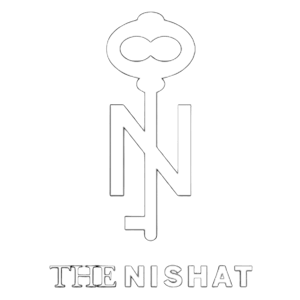

# The Nishat Hotel & Properties — Luxury Digital Hospitality Portal



A high-performance, mobile-first 5-star digital hospitality and direct-booking portal for **The Nishat Hotel & Properties**, built with **React**, **Tailwind CSS**, and **Lucide Icons**.

**GitHub Repository**: [https://github.com/denzik-design/nishat-hotel](https://github.com/denzik-design/nishat-hotel)

---

## 🌟 Flagship Locations (Multi-Property Support)

The booking engine and event catalogs dynamically adapt to all 3 flagship properties:
1. **The Nishat Hotel — Johar Town, Lahore** (Adjacent to Emporium Mall & Expo Centre)
2. **The Nishat Hotel — Gulberg, Lahore** (Central Fashion & Business District, MM Alam Road)
3. **The Nishat Hotel — Islamabad** (Capital Executive Stay near Diplomatic Enclave)

---

## 🚀 Key Features

### 1. Stay & Suites (Frictionless Direct Booking)
* **Curated 5-Star Accommodations**: Presidential Suites, Executive Skyline Rooms, and Deluxe Suites with verified specs (sqm, bathroom finishes, view types).
* **Interactive 360° Virtual Panoramic Tour**: Mouse and touch drag-to-pan horizontal 360° room viewer with pulsing gold amenity hotspots and instant booking CTA.
* **Single-Page Checkout (SPCO)**: High-margin upsells (VIP Mercedes S-Class Chauffeur, Royal High-Tea for Two, Oasis Spa sessions) with live PKR/USD dynamic price calculation.
* **Instant Confirmation State**: Printable PDF folio (`window.print()`) and direct WhatsApp voucher dispatch.

### 2. Digital Loyalty Pass & Temporary Room Key (Apple & Google Wallet)
* **Nishat Privilege Club Pass (Permanent)**:
  * Metallic Black & Gold luxury pass for **Nishat Black Elite Tier** (`14,850 PTS`).
  * Permanent **"Add to Apple Wallet"** & **"Save to Google Wallet"** buttons with NFC contactless support.
* **Temporary Digital Room Keycard (Suite 704)**:
  * Stay-duration validity strictly from **2:00 PM Check-in** to **2:00 PM Check-out**.
  * Interactive **NFC Tap-to-Unlock** door simulator with animated signal waves and access-granted indicators.
  * Temporary Apple & Google Wallet hotel passes that automatically expire and delete themselves upon check-out.

### 3. Banquets, Weddings & Grand Conventions
* Dedicated venue showcases: *The Grand Crystal Ballroom* (1,500 capacity), *The Imperial Hall* (450 capacity), and *The Margalla Grand Ballroom* (600 capacity).
* Interactive Event Cost Calculator: Guest count slider (50 to 1,500 guests), 3 curated menu tiers (*Silver Prestige*, *Imperial Gold*, *Sultanate Platinum*), and luxury add-ons (Floral decor, Live Shehnai, 4K LED Screen, Valet fleet).

### 4. Haute Cuisine, Royal Buffets & Signature High-Tea
* **Banu Chaudhry Grand Royal Dinner Buffet**: 120+ International and Pakistani delicacies, live charcoal BBQ, sushi counter, and Belgian chocolate fountain.
* **The Nishat Signature Royal Afternoon High-Tea for Two**: 3-tier gold tiered stand with Scottish smoked salmon sandwiches, warm scones with Devonshire clotted cream, and Kashmiri pink chai.
* **Sunday Grand Poolside Family Brunch** & **Executive Business Lunch**.
* Direct table reservation modal with date, time slots, and WhatsApp vouchers.

### 5. The Oasis Spa & Hydrotherapy
* Aromatherapy massage, Turkish Hammams, and heated Olympic indoor swimming pool day passes.

### 6. Global Currency Switcher
* Instant dynamic conversion between **PKR (Rs)** and **USD ($)** ($1 = 280 PKR) across room rates, banquet catering, dining covers, and taxes.

---

## 💻 Tech Stack

* **Frontend Framework**: React 18
* **Styling**: Tailwind CSS with custom luxury color palette (Royal Navy `#0f172a`, Champagne Gold `#b48c48`, Warm Ivory `#faf9f6`)
* **Typography**: Cinzel (Serif), Playfair Display, Plus Jakarta Sans
* **Icons**: Lucide React
* **Build Tool**: Vite 5

---

## 🛠️ Getting Started Locally

```bash
# Clone the repository
git clone https://github.com/denzik-design/nishat-hotel.git

# Navigate into directory
cd nishat-hotel

# Install dependencies
npm install

# Start local development server
npm run dev

# Build for production
npm run build
```

---

© The Nishat Hotel & Properties. All Rights Reserved.
